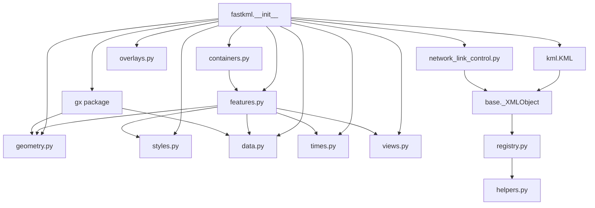
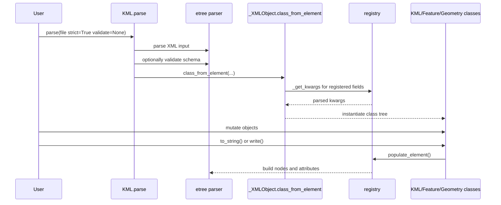

`fastkml` is organized around a small set of core abstractions: XML base classes, a registry that maps Python attributes to XML nodes, and domain modules that model KML features, geometry, styling, timing, and overlays. The public entry point in `fastkml/__init__.py` re-exports the main classes, then imports `fastkml/_registry_setup.py` so delayed registrations such as `Track.extended_data` and `Update` action payloads are available before user code parses documents.

## Key Design Decisions

### Registry-driven XML mapping

The central decision lives in `fastkml/registry.py` and `fastkml/base.py`: parsing and serialization rules are registered outside the classes themselves. `_XMLObject.populate_element()` iterates through `registry.get(self.__class__)`, while `_XMLObject._get_kwargs()` walks the same registry in reverse during parsing. That keeps constructors focused on domain state and lets the library extend behavior without copying XML code into every model.

### A shared XML foundation

Nearly every public class inherits from `_XMLObject` or `_BaseObject`. `_XMLObject` in `fastkml/base.py` provides `from_string()`, `to_string()`, `etree_element()`, `class_from_element()`, and `validate()`. `_BaseObject` in `fastkml/kml_base.py` adds common KML object attributes such as `id` and `target_id`. This means containers, styles, geometry objects, and `NetworkLinkControl` behave consistently when you parse, compare, serialize, or validate them.

### Geometry as an adapter layer

Geometry objects in `fastkml/geometry.py` are wrappers around `pygeoif` geometry instances rather than bespoke coordinate containers. `Placemark.__init__()` in `fastkml/features.py` accepts either a prebuilt KML geometry object or a generic geometry and converts it through `create_kml_geometry()`. That reduces friction when your application already uses geometry objects elsewhere.

### Configurable XML backend

`fastkml/config.py` tries to import `lxml.etree` first and falls back to `xml.etree.ElementTree`. The code paths in `kml.py`, `base.py`, and `validator.py` are written so the same object model works either way. `lxml` unlocks pretty-printing and schema validation; the fallback keeps the dependency surface small for simple workloads.

## Data Lifecycle

When parsing, `KML.parse()` in `fastkml/kml.py` reads the XML, infers the namespace from the root tag, merges user-provided namespaces with `config.NAME_SPACES`, and delegates to `class_from_element()`. During serialization, the direction reverses: `to_string()` calls `etree_element()`, `populate_element()` visits registry items, and helper functions in `fastkml/helpers.py` write text nodes, attributes, or nested child objects.

## How The Pieces Fit Together

- `kml.py` owns the root document wrapper, file parsing, and KML versus KMZ writing.
- `containers.py` and `features.py` define the recursive tree of user-visible features.
- `geometry.py`, `model.py`, `views.py`, `times.py`, and `overlays.py` model specialized KML subtrees referenced by features.
- `data.py` and `gx/data.py` handle untyped, typed, and array-based metadata.
- `styles.py` centralizes shared style definitions and style maps that documents and features can reference.
- `network_link_control.py` models update payloads for remote KML refresh workflows.
- `utils.py`, `validator.py`, and `config.py` provide traversal, schema validation, and backend configuration utilities.

The result is a library that is object-oriented at the edges but declarative in the middle. That balance is why fastkml can cover a broad slice of the KML spec without turning every model class into a custom parser.
