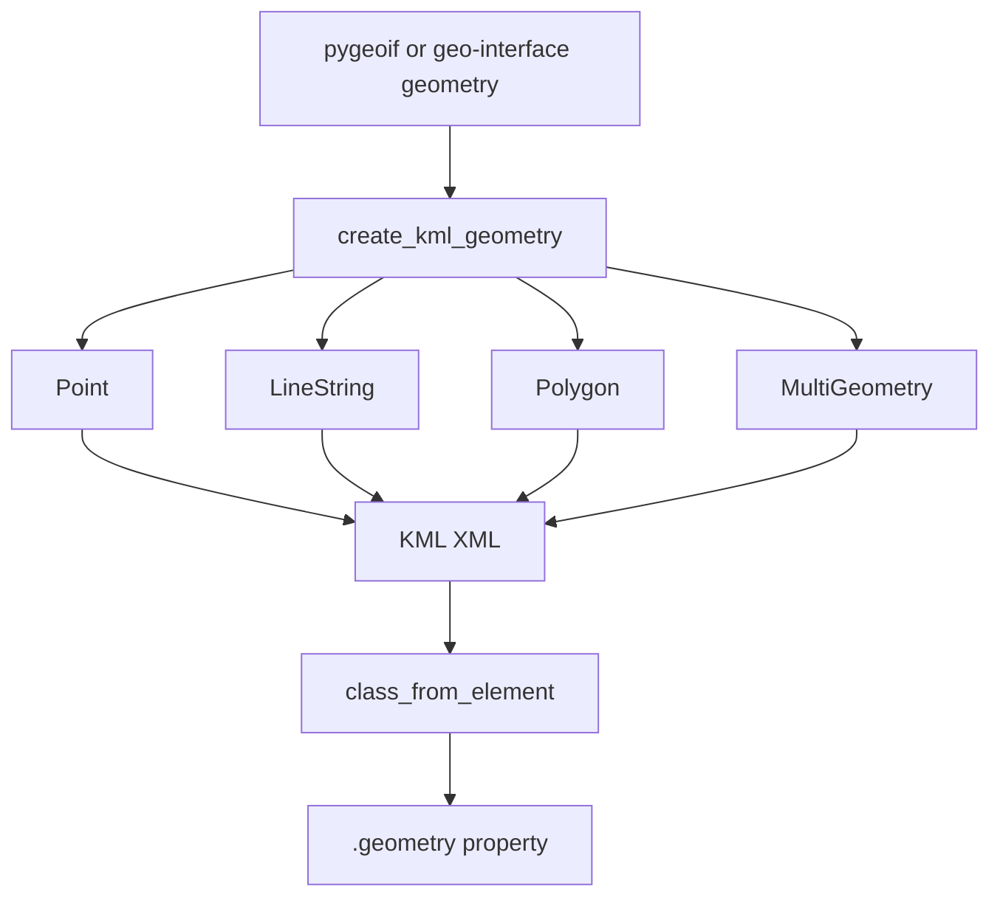

`fastkml` does not treat geometry as opaque XML. Instead, it bridges between KML geometry elements and Python geometry objects from `pygeoif`, plus any object that can be converted into that shape model. This is why the library feels natural in GIS-heavy code: you can hand a `Placemark` a `pygeoif.Point` or `Polygon`, and fastkml will emit the matching `Point`, `LineString`, `Polygon`, or `MultiGeometry` subtree for you.

The core implementation lives in `fastkml/geometry.py`. `Point`, `LineString`, `LinearRing`, `Polygon`, and `MultiGeometry` are KML wrappers that expose a `.geometry` property. On input, constructors accept either native KML wrapper objects such as `Coordinates` or geospatial objects such as `geo.Point`. On output, `.geometry` reconstructs `pygeoif` objects from the stored KML state. `Placemark.__init__()` in `fastkml/features.py` uses `create_kml_geometry()` to pick the right wrapper automatically.



## How It Relates To Other Concepts

- The geometry bridge powers `Placemark`, `Model`, and the `gx` track classes.
- Style classes affect how geometry renders, but not how it is stored.
- Validation only checks XML correctness; geometry constructors enforce the higher-level mutual-exclusion rules.

## How It Works Internally

Each geometry constructor guards against ambiguous input. `Point`, `LineString`, and `BoundaryIs` raise `GeometryError` when you pass both raw geometry and prebuilt KML coordinate objects. `Polygon` builds `OuterBoundaryIs` and `InnerBoundaryIs` wrappers from a `pygeoif.Polygon`. `MultiGeometry` can either take explicit KML geometry objects or explode a multi-geometry input into a list of KML geometry wrappers while preserving shared flags like `extrude`, `tessellate`, and `altitude_mode`.

The reverse conversion happens lazily. A `Point` stores `kml_coordinates`, not a `pygeoif.Point`, and its `.geometry` property recreates a geometry object only when you access it. The same pattern appears in `LineString.geometry`, `Polygon.geometry`, and `MultiGeometry.geometry`. That keeps parsing focused on XML correctness and only pays conversion costs when you actually need application-level geometry objects.

## Basic Usage

```python
from fastkml import Placemark
from pygeoif import LineString

route = LineString([(13.4, 52.5, 0), (13.45, 52.51, 0), (13.5, 52.52, 0)])
placemark = Placemark(name="Route" geometry=route)

print(type(placemark.kml_geometry).__name__)
print(placemark.geometry.wkt)
```

## Advanced Usage

```python
from fastkml.geometry import MultiGeometry, create_kml_geometry
from fastkml.enums import AltitudeMode
from pygeoif import GeometryCollection, Point, Polygon

collection = GeometryCollection(
    [
        Point(8.54, 47.37, 10),
        Polygon([(8.5, 47.3, 0), (8.6, 47.4, 0), (8.7, 47.3, 0)]),
    ]
)

kml_geom = create_kml_geometry(
    collection,
    extrude=True,
    altitude_mode=AltitudeMode.relative_to_ground,
)

assert isinstance(kml_geom, MultiGeometry)
print(len(kml_geom.kml_geometries))
```

<Callout type="warn">Do not pass both `geometry` and `kml_coordinates` or both `geometry` and `kml_geometry` to the same constructor. Those pairs are mutually exclusive by design, and fastkml raises `GeometryError` or `ValueError` immediately to prevent ambiguous serialization.</Callout>

<Accordions>
<Accordion title="Why geometry conversion is lazy">
Lazy conversion keeps parsing fast and avoids constructing geometry objects that user code may never inspect. When you parse a large KML file and only need names or metadata, the geometry wrappers remain lightweight containers around KML coordinates and boundary nodes. The downside is that some geometry issues only become obvious when you access `.geometry`, because that is where `pygeoif` reconstruction happens. This is a reasonable trade-off for document-oriented workloads, but it is worth remembering in data-cleaning pipelines.
</Accordion>
<Accordion title="Why MultiGeometry explodes collections into child wrappers">
`MultiGeometry` stores a list of child KML geometry wrappers instead of a single generic collection object because KML itself is heterogeneous at that point. That design lets fastkml preserve per-geometry settings such as `extrude` and `altitude_mode` when converting from a Python collection. It also makes recursive traversal and reserialization straightforward because each child participates in the same registry-backed model as any standalone geometry. The trade-off is that bulk edits across a large collection are list operations rather than vectorized geometry transforms.
</Accordion>
</Accordions>
