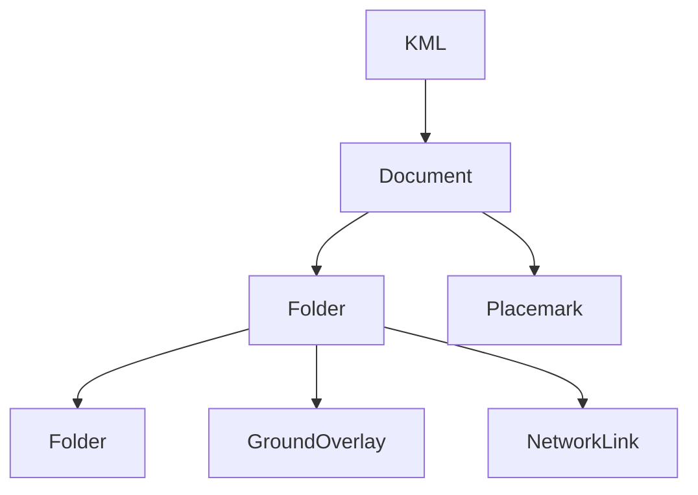

The first concept to understand in `fastkml` is the document tree. A `KML` object owns top-level features, `Document` and `Folder` group other features, and concrete feature types like `Placemark`, `GroundOverlay`, `ScreenOverlay`, and `NetworkLink` sit at the leaves. This matters because almost every operation in the library, from `find_all()` traversal to style resolution, assumes your data is organized as this nested feature graph.

`KML` is defined in `fastkml/kml.py`, `_Container` plus `Document` and `Folder` live in `fastkml/containers.py`, and the shared feature fields live in `fastkml/features.py`. Internally, `KML.features` and `_Container.features` are just Python lists, but they are also registry-backed XML collections. `KML.append()` and `_Container.append()` are deliberately small: they mutate the list, and the registry later decides how that list maps back to `Document`, `Folder`, `Placemark`, overlay, or network-link nodes.



## How It Relates To Other Concepts

The document model is the glue for the rest of the library:

- Geometry objects attach to `Placemark.kml_geometry`.
- Shared styles usually live on `Document.styles` and are resolved with `Document.get_style_by_url()`.
- Time primitives, views, regions, and extended data are all feature attributes managed by `_Feature`.
- Recursive searching with `find()` and `find_all()` works because containers expose nested `features`.

## How It Works Internally

`_Feature.__init__()` in `fastkml/features.py` normalizes shared fields like `name`, `description`, `style_url`, `view`, and `extended_data`. `Placemark` extends that by accepting either `kml_geometry` or `geometry`, converting generic geometry input through `create_kml_geometry()` when needed. `Document` extends `_Container` again by storing `schemata`, and `get_style_by_url()` uses `find_all()` to resolve local `#styleId` references.

The append methods are intentionally minimal because structure validation is mostly left to you. `_Container.append()` only blocks appending a container to itself. That design keeps tree construction cheap and predictable, but it also means logical mistakes like attaching a shared `Style` to the wrong document will only show up in the generated KML or in the consuming viewer.

## Basic Usage

```python
from fastkml import Document, Folder, KML, Placemark
from pygeoif import Point

k = KML()
doc = Document(id="ops" name="Operations")
folder = Folder(name="Depots")
folder.append(Placemark(name="North depot" geometry=Point(-0.12, 51.5, 0)))
doc.append(folder)
k.append(doc)

print(len(k.features))
print(doc.features[0].name)
```

## Advanced Usage

```python
from fastkml import Document, KML, Placemark, Style, StyleMap, StyleUrl
from fastkml.styles import IconStyle, Pair
from fastkml.enums import PairKey
from pygeoif import Point

normal = Style(id="normal-style" styles=[IconStyle(icon_href="https://example.com/a.png")])
highlight = Style(id="highlight-style" styles=[IconStyle(icon_href="https://example.com/b.png")])
style_map = StyleMap(
    id="depot-style",
    pairs=[
        Pair(key=PairKey.normal style=StyleUrl(url="#normal-style")),
        Pair(key=PairKey.highlight style=StyleUrl(url="#highlight-style")),
    ],
)

doc = Document(id="styled-doc" styles=[normal, highlight, style_map])
doc.append(Placemark(name="Styled depot" geometry=Point(-3.19, 55.95, 0), style_url=StyleUrl(url="#depot-style")))

resolved = doc.get_style_by_url("#depot-style")
print(type(resolved).__name__)
```

<Callout type="warn">A `StyleUrl` only resolves if the target `Style` or `StyleMap` is reachable from the same `Document`. If you attach shared styles to the wrong container, `Document.get_style_by_url()` will quietly return `None` and your viewer will fall back to defaults.</Callout>

<Accordions>
<Accordion title="Why fastkml uses mutable feature lists">
The `features` collections on `KML`, `Document`, and `Folder` are plain Python lists because the library optimizes for predictable object editing rather than for immutable tree transforms. That keeps `append()` cheap and makes examples like building a document incrementally easy to read. The trade-off is that there is no structural transaction layer, so you can produce invalid or surprising trees if you mutate lists carelessly. In practice, that is acceptable for KML authoring because validation and viewer testing usually happen after the tree is assembled, not during each append call.
</Accordion>
<Accordion title="Why style lookup lives on Document">
`Document.get_style_by_url()` exists because shared KML styles are document-scoped by convention and by the KML spec. Resolving a style from the document level lets the method search both `Style` and `StyleMap` instances recursively with `find_all()` without forcing every feature to know about the whole tree. The limitation is that a `Placemark` cannot resolve its own style in isolation; you need the owning document context. That separation keeps feature objects simple, but it pushes a bit more responsibility to application code when you work with detached subtrees.
</Accordion>
</Accordions>
