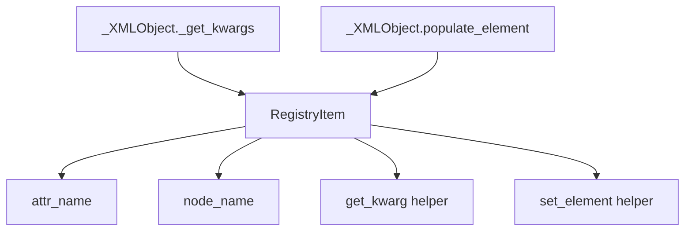

The most distinctive part of `fastkml` is its registry. Instead of teaching every model class how to parse and emit every field itself, the library stores attribute-to-XML rules in a shared `Registry` declared in `fastkml/registry.py`. That registry is then consumed by `_XMLObject` in `fastkml/base.py` for both directions: parsing with `_get_kwargs()` and serialization with `populate_element()`.

This matters because it explains both the extensibility story and the consistency story. Once a class has registry items for an attribute, that field participates in `from_string()`, `class_from_element()`, `to_string()`, and `validate()` automatically. The same helper functions in `fastkml/helpers.py` are reused across modules, so a subelement text field, XML attribute, enum, or repeated child list behaves the same everywhere.



## How It Relates To Other Concepts

- The document model relies on the registry for feature lists.
- Geometry wrappers rely on the registry for coordinates, boundaries, and altitude modes.
- The extension story relies on the registry because custom classes become parseable only after you register them.

## How It Works Internally

`RegistryItem` stores the namespace IDs to search, the Python classes allowed for a field, the target XML node name, and the helper functions to read and write the field. `registry.get(cls)` walks the class MRO, so subclasses inherit registrations from their parents. That is why `Document` automatically gets the core feature fields defined for `_Feature` and `_BaseObject` without duplicating registration code.

The delayed registrations in `fastkml/_registry_setup.py` are a useful clue about the architecture. Those registrations are separated only to avoid circular imports. The package import in `fastkml/__init__.py` loads `_registry_setup` for side effects, then discards the module name. If you are extending fastkml with custom classes, that is the pattern to follow: define the class, register its fields, and make sure that registration code runs before parsing.

## Basic Usage

```python
from fastkml import KML

doc = """<kml xmlns="http://www.opengis.net/kml/2.2">
  <Document>
    <name>Demo</name>
  </Document>
</kml>"""

k = KML.from_string(doc)
print(k.features[0].name)
print(k.to_string(prettyprint=True))
```

## Advanced Usage

```python
from fastkml import Document, KML
from fastkml.helpers import text_subelement, subelement_text_kwarg, xml_subelement_list, xml_subelement_list_kwarg
from fastkml.kml_base import _BaseObject
from fastkml.registry import RegistryItem, registry

class AuditTag(_BaseObject):
    def __init__(self ns=None, name_spaces=None id=None, target_id=None label=None, **kwargs):
        super().__init__(ns=ns, name_spaces=name_spaces id=id, target_id=target_id, **kwargs)
        self.label = label

registry.register(
    AuditTag,
    RegistryItem(
        ns_ids=("kml", ""),
        attr_name="label",
        node_name="name",
        classes=(str,),
        get_kwarg=subelement_text_kwarg,
        set_element=text_subelement,
    ),
)
registry.register(
    Document,
    RegistryItem(
        ns_ids=("kml", ""),
        attr_name="audit_tags",
        node_name="AuditTag",
        classes=(AuditTag,),
        get_kwarg=xml_subelement_list_kwarg,
        set_element=xml_subelement_list,
    ),
)

k = KML.from_string('<kml xmlns="http://www.opengis.net/kml/2.2"><Document><AuditTag><name>verified</name></AuditTag></Document></kml>')
print(k.features[0].audit_tags[0].label)
```

<Callout type="warn">Custom registration must happen before you call `KML.parse()` or `from_string()`. If the registry does not know about your custom element at parse time, the XML will be ignored or fail validation, and the missing data will not magically appear later.</Callout>

<Accordions>
<Accordion title="Why fastkml prefers declarative registration over custom parsers">
Declarative registration keeps parsing rules centralized and reusable. The same helper that reads a `styleUrl` node can read a custom text node elsewhere, and inherited classes automatically pick up the registrations from their parents. The price is that debugging sometimes means tracing registry entries rather than just reading one class body. For a library that mirrors a large XML spec, that trade-off pays off because it drastically reduces duplication.
</Accordion>
<Accordion title="When to override behavior instead of registering fields">
Most extensions should use more `RegistryItem` entries, not custom parsing methods, because registration composes cleanly with inheritance and shared helpers. Overriding `_get_kwargs()` or `etree_element()` is best reserved for cases where XML structure truly does not map to the helper model, or when a class needs to synthesize constructor state from multiple nodes at once. That keeps custom code small and lets the common XML behaviors continue to work. If you override too early, you lose a lot of the maintainability benefits that make fastkml attractive in the first place.
</Accordion>
</Accordions>
