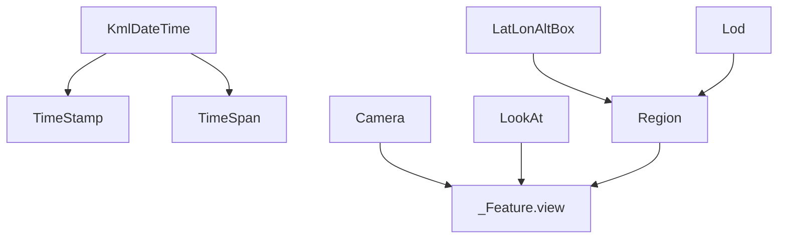

KML is not only about geometry. Many viewer workflows depend on time primitives, saved camera positions, and region-based level-of-detail rules. `fastkml` groups those concepts across `fastkml/times.py`, `fastkml/views.py`, and `fastkml/mixins.py`, and then reuses them on features, overlays, tracks, and network-link control objects.

`KmlDateTime` is the core time value abstraction. It stores a Python `date` or `datetime` plus a KML-specific resolution, so a year-only value stays a year-only value instead of being inflated into an arbitrary day. `TimeStamp` models a single instant, `TimeSpan` models a bounded interval, `Camera` and `LookAt` define viewpoints, and `Region` combines `LatLonAltBox` with `Lod` to tell viewers when a feature should be active.



## How It Relates To Other Concepts

- `TimeMixin` lets features and views carry `TimeStamp` or `TimeSpan`.
- `gx:Track` reuses `KmlDateTime` for per-point timestamps.
- Regions, cameras, and look-at views are just feature fields, so they serialize through the same registry pipeline as any other nested object.

## How It Works Internally

`adjust_date_to_resolution()` in `fastkml/times.py` keeps the stored value aligned with the requested precision. `KmlDateTime.parse()` accepts year, year-month, date, and full datetime formats, then chooses the right `DateTimeResolution`. On the view side, `_AbstractView` in `fastkml/views.py` defines shared spatial properties, while `Camera` adds `roll` and `LookAt` adds `range`. `Region` is intentionally compositional rather than flat: it stores a `LatLonAltBox` plus an optional `Lod`, which matches the KML schema exactly.

## Basic Usage

```python
from datetime import datetime, timezone
from fastkml import KmlDateTime, Placemark, TimeStamp
from pygeoif import Point

stamp = TimeStamp(
    timestamp=KmlDateTime(datetime(2025, 5, 1, 9, 30, tzinfo=timezone.utc))
)
placemark = Placemark(name="Inspection", geometry=Point(8.68, 50.11, 0), times=stamp)

print(str(placemark.times.timestamp))
```

## Advanced Usage

```python
from fastkml import Camera, Document, KmlDateTime, LookAt, Region, TimeSpan
from fastkml.views import LatLonAltBox, Lod
from datetime import date

region = Region(
    lat_lon_alt_box=LatLonAltBox(north=52.6, south=52.4, east=13.5, west=13.2),
    lod=Lod(min_lod_pixels=256, max_lod_pixels=-1),
)

doc = Document(
    name="Mission plan",
    view=Camera(
        longitude=13.4, latitude=52.5, altitude=850, heading=25, tilt=60, roll=0
    ),
    times=TimeSpan(
        begin=KmlDateTime(date(2025, 5, 1)), end=KmlDateTime(date(2025, 5, 7))
    ),
    region=region,
)

alternate = LookAt(
    longitude=13.4, latitude=52.5, altitude=0, heading=0, tilt=45, range=1200
)
print(type(doc.view).__name__)
print(alternate.range)
```

<Callout type="warn">Be explicit about datetime timezone handling. `KmlDateTime.__eq__()` normalizes timezone-aware datetimes to UTC before comparison, but naive datetimes stay naive. Mixing the two in application logic is a reliable way to create subtle historical playback bugs.</Callout>

<Accordions>
<Accordion title="Precision-aware KmlDateTime versus raw datetime values">
Storing resolution alongside the date value is crucial because KML makes a semantic distinction between `2025`, `2025-05`, `2025-05-01`, and a full timestamp. A plain Python `datetime` cannot preserve that distinction without extra metadata, so fastkml wraps it in `KmlDateTime`. The trade-off is one extra object in your code, but it prevents lossy round trips and makes serialization deterministic. That is especially important for archival or schedule-driven KML feeds.
</Accordion>
<Accordion title="Camera versus LookAt">
Use `Camera` when you need full six-degree-of-freedom control over the viewer position, including roll. Use `LookAt` when you care more about the target location and stand-off range than about the exact camera pose. Both serialize cleanly because they inherit from the same abstract view base, but the semantics in consuming viewers are different. Choosing the simpler abstraction usually makes your KML easier to reason about and easier for other tools to modify later.
</Accordion>
</Accordions>
