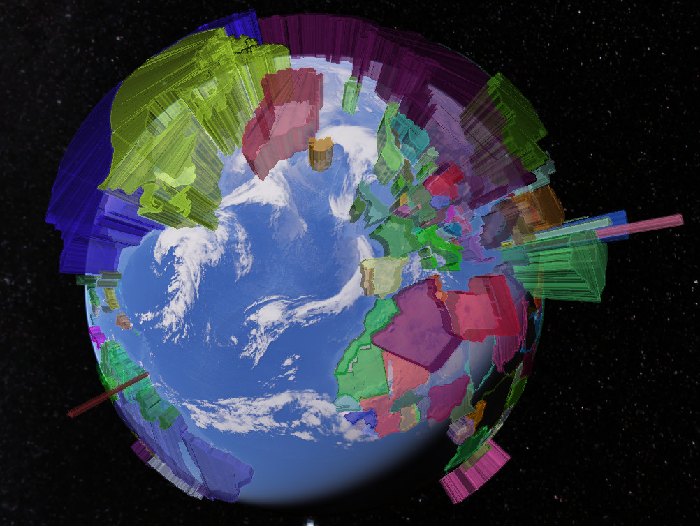

Creating KML files
==================

Read a shapefile and build a 3D KML visualization.
--------------------------------------------------

This example shows how to read a shapefile and build a 3D KML visualization from it.

You will need to install `pyshp <https://pypi.org/project/pyshp/>`_ (``pip install pyshp``).

For this example we will use the
`Data on CO2 and Greenhouse Gas Emissions <https://github.com/owid/co2-data>`_ by
Our World in Data, and the Small scale data (1:110m) shapefile from
`Natural Earth <https://www.naturalearthdata.com/downloads/>`_.

First we import the necessary modules:

.. code-block:: python

    import csv
    import pathlib
    import random

    import shapefile
    from pygeoif.factories import force_3d
    from pygeoif.factories import shape

    import fastkml
    import fastkml.containers
    import fastkml.features
    import fastkml.styles
    from fastkml.enums import AltitudeMode
    from fastkml.geometry import create_kml_geometry

Read the shapefile:

.. code-block:: python

    shp = shapefile.Reader("ne_110m_admin_0_countries.shp")

Read the CSV file and store the CO2 data for 2020:

.. code-block:: python

    co2_csv = pathlib.Path("owid-co2-data.csv")
    co2_data = {}
    with co2_csv.open() as csvfile:
        reader = csv.DictReader(csvfile)
        for row in reader:
            if row["year"] == "2020":
                co2_data[row["iso_code"]] = (
                    float(row["co2_per_capita"]) if row["co2_per_capita"] else 0
                )

We prepare the styles and placemarks for the KML file, using random colors for each
country and the CO2 emissions as the height of the geometry. The shapefile offers
a handy ``__geo_interface__`` attribute that we can use to iterate over the features,
just like we would with a ``GeoJSON`` object, and extract the necessary information:

.. code-block:: python

    placemarks = []
    for feature in shp.__geo_interface__["features"]:
        iso3_code = feature["properties"]["ADM0_A3"]
        geometry = shape(feature["geometry"])
        co2_emission = co2_data.get(iso3_code, 0)
        geometry = force_3d(geometry, co2_emission * 100_000)
        kml_geometry = create_kml_geometry(
            geometry,
            extrude=True,
            altitude_mode=AltitudeMode.relative_to_ground,
        )
        color = random.randint(0, 0xFFFFFF)
        style = fastkml.styles.Style(
            id=iso3_code,
            styles=[
                fastkml.styles.LineStyle(color=f"33{color:06X}", width=2),
                fastkml.styles.PolyStyle(
                    color=f"88{color:06X}",
                    fill=True,
                    outline=True,
                ),
            ],
        )
        placemark = fastkml.features.Placemark(
            name=feature["properties"]["NAME"],
            description=feature["properties"]["FORMAL_EN"],
            kml_geometry=kml_geometry,
            styles=[style],
        )
        placemarks.append(placemark)

Finally, we create the KML object and write it to a file:

.. code-block:: python

    document = fastkml.containers.Document(features=placemarks, styles=styles)
    kml = fastkml.KML(features=[document])

    outfile = pathlib.Path("co2_per_capita_2020.kml")
    with outfile.open("w") as f:
        f.write(kml.to_string(prettyprint=True, precision=6))

The resulting KML file can be opened in Google Earth or any other KML viewer.

Build an animated over time KML visualization
----------------------------------------------

This example shows how to build an animated KML visualization over time.
We will use the same data as in the previous example, but this time we will
create a KML file that shows the CO2 emissions accumulating from 1995 to 2022.

First we import the necessary modules:

.. code-block:: python

    import csv
    import pathlib
    import random
    import datetime
    import shapefile
    from pygeoif.factories import force_3d
    from pygeoif.factories import shape

    import fastkml
    import fastkml.containers
    import fastkml.features
    import fastkml.styles
    import fastkml.times
    from fastkml.enums import AltitudeMode, DateTimeResolution
    from fastkml.geometry import create_kml_geometry

Read the shapefile, the CSV file and store the CO2 data for each year:

.. code-block:: python

    shp = shapefile.Reader("ne_110m_admin_0_countries.shp")
    co2_csv = pathlib.Path("owid-co2-data.csv")
    co2_pa = {str(i): {} for i in range(1995, 2023)}
    with co2_csv.open() as csvfile:
        reader = csv.DictReader(csvfile)
        for row in reader:
            if row["year"] >= "1995":
                co2_pa[row["year"]][row["iso_code"]] = (
                    float(row["co2_per_capita"]) if row["co2_per_capita"] else 0
                )

This time we will create a folder for each country, and a placemark for each year,
with the CO2 emissions per capita as the height of the geometry.
We will also create a style for each country, which we store at the document level to
prevent creating duplicate styles.
Each placemark will have a time-span that covers the whole year:

.. code-block:: python

    styles = []
    folders = []
    for feature in shp.__geo_interface__["features"]:
        iso3_code = feature["properties"]["ADM0_A3"]
        geometry = shape(feature["geometry"])
        color = random.randint(0, 0xFFFFFF)
        styles.append(
            fastkml.styles.Style(
                id=iso3_code,
                styles=[
                    fastkml.styles.LineStyle(color=f"33{color:06X}", width=2),
                    fastkml.styles.PolyStyle(
                        color=f"88{color:06X}",
                        fill=True,
                        outline=True,
                    ),
                ],
            ),
        )
        style_url = fastkml.styles.StyleUrl(url=f"#{iso3_code}")
        folder = fastkml.containers.Folder(name=feature["properties"]["NAME"])
        co2_growth = 0
        for year in range(1995, 2023):
            co2_year = co2_pa[str(year)].get(iso3_code, 0)
            co2_growth += co2_year

            kml_geometry = create_kml_geometry(
                force_3d(geometry, co2_growth * 5_000),
                extrude=True,
                altitude_mode=AltitudeMode.relative_to_ground,
            )
            timespan = fastkml.times.TimeSpan(
                begin=fastkml.times.KmlDateTime(
                    datetime.date(year, 1, 1), resolution=DateTimeResolution.year_month
                ),
                end=fastkml.times.KmlDateTime(
                    datetime.date(year, 12, 31), resolution=DateTimeResolution.year_month
                ),
            )
            placemark = fastkml.features.Placemark(
                name=f"{feature['properties']['NAME']} - {year}",
                description=feature["properties"]["FORMAL_EN"],
                kml_geometry=kml_geometry,
                style_url=style_url,
                times=timespan,
            )
            folder.features.append(placemark)
        folders.append(folder)

Finally, we create the KML object and write it to a file:

.. code-block:: python

    document = fastkml.containers.Document(features=folders, styles=styles)
    kml = fastkml.KML(features=[document])

    outfile = pathlib.Path("co2_growth_1995_2022.kml")
    with outfile.open("w") as f:
        f.write(kml.to_string(prettyprint=True, precision=3))

You can open the resulting KML file in Google Earth Desktop and use the time slider to
see the CO2 emissions per capita grow over time, Google Earth Web does not support
time animations.
