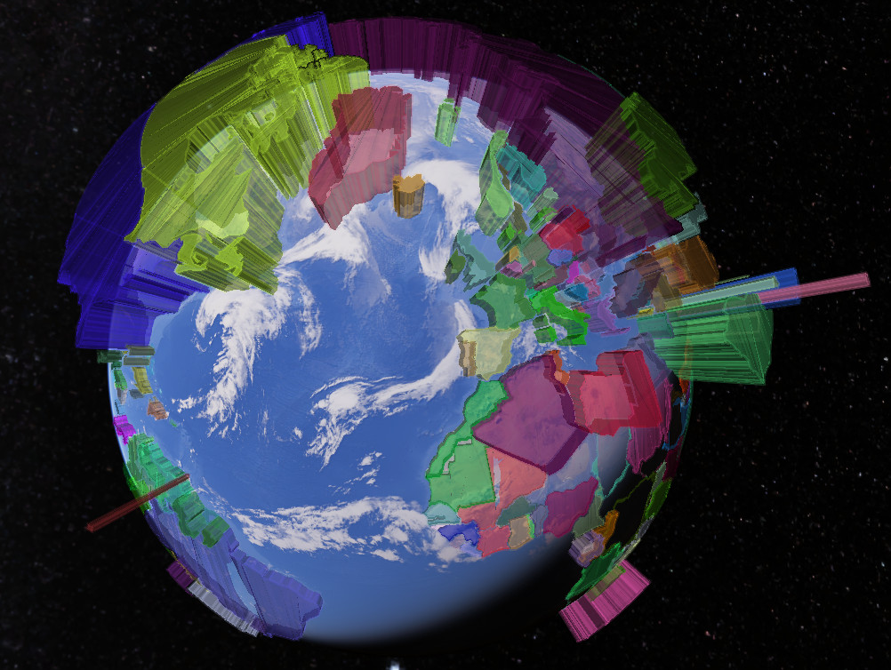

Usage guide
===========

Read a shapefile and build a 3D KML visualization.
--------------------------------------------------

This example shows how to read a shapefile and build a 3D KML visualization from it.

You will need to install the following packages:

- `pyshp <https://pypi.org/project/pyshp/>`_

For this example we will use the
`Data on CO2 and Greenhouse Gas Emissions <https://github.com/owid/co2-data>`_ by
Our World in Data, and the Small scale data (1:110m) shapefile from
`Natural Earth <https://www.naturalearthdata.com/downloads/>`_.

First we import the necessary modules:

.. code-block:: python

    import csv
    import pathlib
    import random

    import shapefile
    from pygeoif.factories import force_3d
    from pygeoif.factories import shape

    import fastkml
    import fastkml.containers
    import fastkml.features
    import fastkml.styles
    from fastkml.enums import AltitudeMode
    from fastkml.geometry import create_kml_geometry

Read the shapefile:

.. code-block:: python

    shp = shapefile.Reader("ne_110m_admin_0_countries.zip")

Read the CSV file and store the CO2 data for 2020:

.. code-block:: python

    co2_csv = pathlib.Path("owid-co2-data.csv")
    co2_data = {}
    with co2_csv.open() as csvfile:
        reader = csv.DictReader(csvfile)
        for row in reader:
            if row["year"] == "2020":
                co2_data[row["iso_code"]] = (
                    float(row["co2_per_capita"]) if row["co2_per_capita"] else 0
                )

We prepare the styles and placemarks for the KML file, using random colors for each
country and the CO2 emissions as the height of the geometry. The shapefile offers
a handy ``__geo_interface__`` attribute that we can use to iterate over the features,
just like we would with a ``GeoJSON`` object, and extract the necessary information:

.. code-block:: python

    styles = []
    placemarks = []
    for feature in shp.__geo_interface__["features"]:
        iso3_code = feature["properties"]["ADM0_A3"]
        geometry = shape(feature["geometry"])
        co2_emission = co2_data.get(iso3_code, 0)
        geometry = force_3d(geometry, co2_emission * 100_000)
        kml_geometry = create_kml_geometry(
            geometry,
            extrude=True,
            altitude_mode=AltitudeMode.relative_to_ground,
        )
        color = random.randint(0, 0xFFFFFF)
        styles.append(
            fastkml.styles.Style(
                id=iso3_code,
                styles=[
                    fastkml.styles.LineStyle(color=f"33{color:06X}", width=2),
                    fastkml.styles.PolyStyle(
                        color=f"88{color:06X}",
                        fill=True,
                        outline=True,
                    ),
                ],
            ),
        )
        style_url = fastkml.styles.StyleUrl(url=f"#{iso3_code}")
        placemark = fastkml.features.Placemark(
            name=feature["properties"]["NAME"],
            description=feature["properties"]["FORMAL_EN"],
            kml_geometry=kml_geometry,
            style_url=style_url,
        )
        placemarks.append(placemark)

Finally, we create the KML object and write it to a file:

.. code-block:: python

    document = fastkml.containers.Document(features=placemarks, styles=styles)
    kml = fastkml.KML(features=[document])

    outfile = pathlib.Path("co2_per_capita_2020.kml")
    with outfile.open("w") as f:
        f.write(kml.to_string(prettyprint=True, precision=6))

The resulting KML file can be opened in Google Earth or any other KML viewer.

