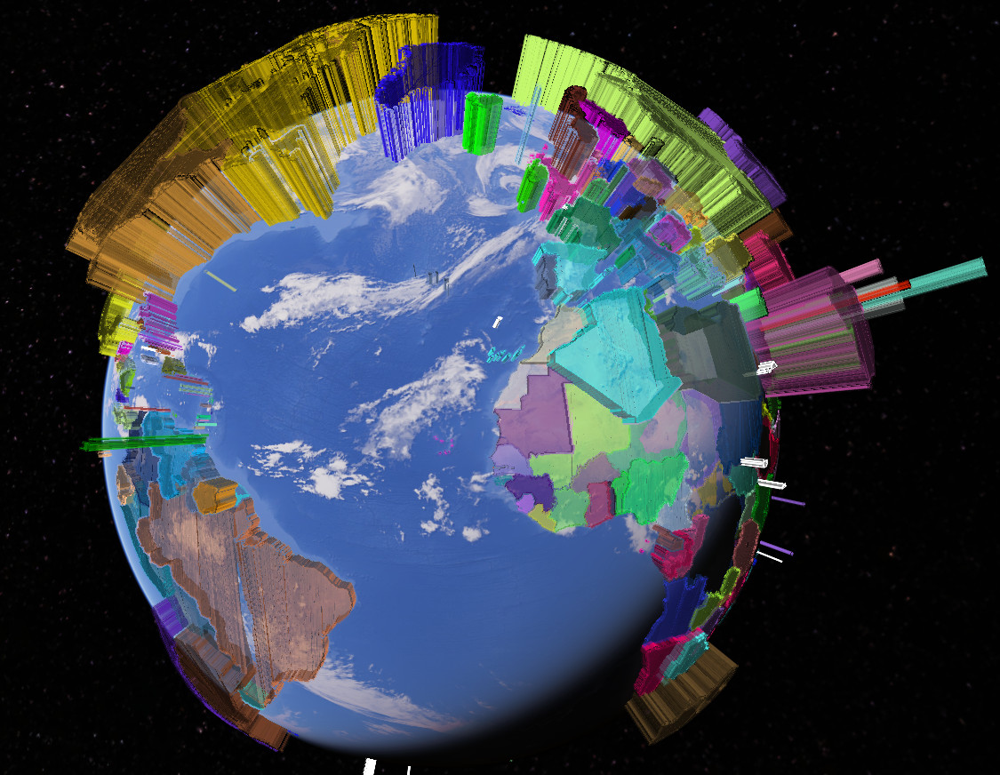

Simply run `UsageExamples.py` to see some ways to use `fastkml` library (which should already be [installed](https://github.com/heltonbiker/fastkml#install)).

File `KML_Samples.kml` was found in [Google Developers](https://developers.google.com/kml/documentation/KML_Samples.kml) site.

For the `shp2kml` example you will need the data from
[Data on CO2 and Greenhouse Gas Emissions by Our World in Data](https://github.com/owid/co2-data)
and the shapefile from
[World Administrative Boundaries - Countries and Territories](https://public.opendatasoft.com/explore/dataset/world-administrative-boundaries/export/)

